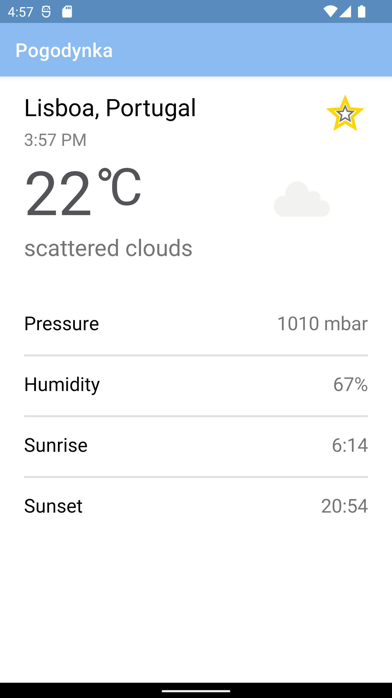
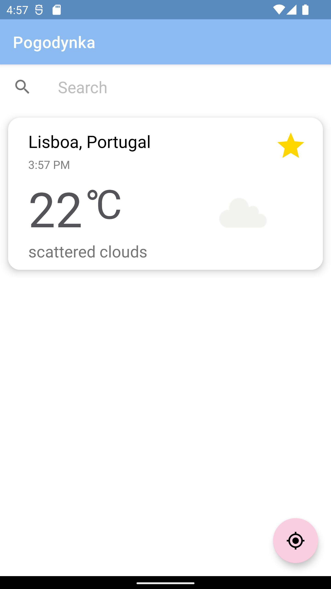
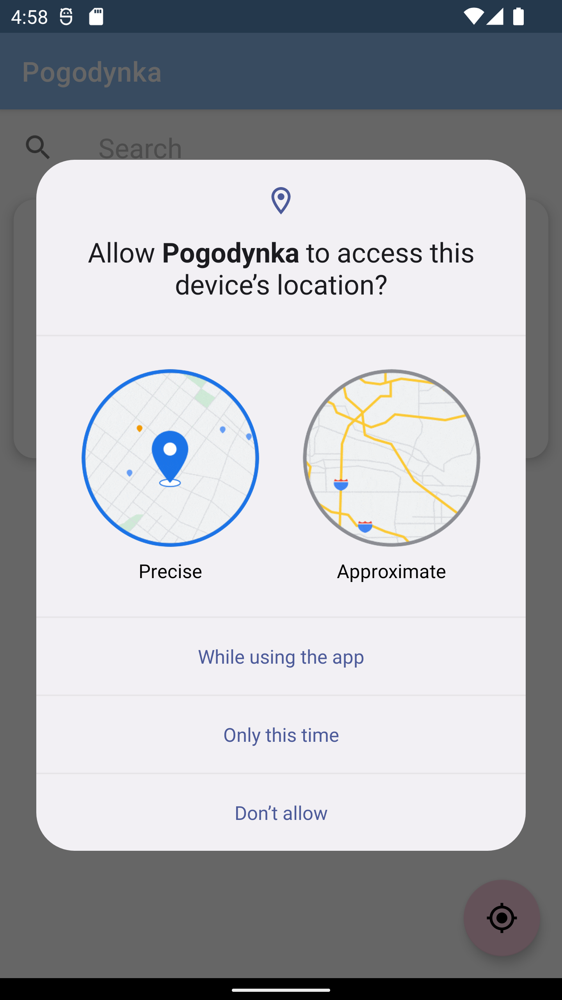

# Pogodynka
A mobile application that allows you to check the current weather at a particular location. Locations can be entered manually or can be downloaded via GPS module. I used Google Maps API, so we can download location from any place on Earth and when entering we get location hints immediately. Favorite location can be added to favorites, so every time you start the application you will get the current weather from your favorite locations.
## Tools
Kotlin, MVVM, Retrofit, Room, Coroutines, Google Maps API
## Screenshots

